# Composable-Nametag

[](https://myhits.vercel.app)
[](https://developer.android.com)
[](https://developer.android.com)
[](https://central.sonatype.com/artifact/io.github.dongx0915.composable.nametag/composable-nametag-runtime)


**[한국어 README](./README_ko.md)**

## Overview


<br>
<br>

Composable-Nametag is a debug tool that overlays the name of every `@Composable` function as a label on your screen.

**Without modifying any existing code**, the Kotlin Compiler Plugin (KCP) automatically injects labels at compile time.
When disabled, the plugin has zero runtime overhead.

<br>

## Screenshots
<div align="center">
    
</div>

<br>
<br>

## Features

- **Zero-touch instrumentation**: The Kotlin Compiler Plugin injects labels at compile time — no manual code changes needed
- **Zero overhead when disabled**: `ComposeDebugConfig.enabled = false` (default) skips all rendering immediately
- **Smart filtering**: Only labels top-level Composable functions (PascalCase); skips lambdas, `remember`, property accessors, etc.
- **Kotlin version safety**: Unsupported Kotlin versions disable only the compiler plugin — the build is never broken
- **Colorful staggered labels**: Each function gets a distinct color and vertical offset to avoid overlap

<br>
<br>

## Installation

### Option A. `plugins {}` block (standard)

Apply the plugin in each **Compose module**'s `build.gradle.kts`.
It **must be declared before** the Compose plugin.

```kotlin
// feature/home/build.gradle.kts (Compose module)
plugins {
    id("io.github.dongx0915.composable.nametag") version "0.0.4-alpha03" // Must be before the compose plugin
    id("org.jetbrains.kotlin.plugin.compose") version "2.1.21" // Use your project's Kotlin version
    // ...
}
```

> No additional `implementation` dependency is needed — the plugin adds the runtime library automatically.
> The Gradle plugin **auto-detects** your project's Kotlin version and resolves the matching compiler artifact.

<br>

### Option B. Convention Plugin

For projects using a Convention Plugin structure (e.g., `build-logic`):

**Step 1.** Add the plugin artifact to your `build-logic/build.gradle.kts`:

```kotlin
// build-logic/build.gradle.kts
dependencies {
    implementation("io.github.dongx0915.composable.nametag:composable-nametag-gradle:0.0.4-alpha03")
}
```

**Step 2.** Apply it inside your Compose Convention Plugin, **before** the Compose plugin:

```kotlin
// e.g., AndroidComposeConventionPlugin.kt
class AndroidComposeConventionPlugin : Plugin<Project> {
    override fun apply(target: Project) {
        with(target) {
            pluginManager.apply("io.github.dongx0915.composable.nametag") // Must be before the compose plugin
            pluginManager.apply("org.jetbrains.kotlin.plugin.compose")
            // ...
        }
    }
}
```

<br>
<br>

### Requirements

- Android API 24 (Android 7.0) or higher
- Kotlin **2.1.21 ~ 2.3.20** (see [Supported Versions](#kotlin-version-compatibility))
- Jetpack Compose (BOM 2025.05.01 or compatible)

<br>
<br>

## Usage

### Enable the overlay

```kotlin
// Application class or wherever you want to toggle
ComposeDebugConfig.enabled = true
```

That's it. All `@Composable` function names will appear as labels on screen.

<br>
<br>

## How It Works



<br>

## Filtering Rules

| Condition | Behavior |
|-----------|----------|
| PascalCase `@Composable` | Label shown |
| camelCase (remember, modifier, etc.) | Skipped |
| Lambda / anonymous | Skipped |
| Property accessor | Skipped |
| `__` prefix | Skipped |

<br>
<br>

## Kotlin Version Compatibility

The compiler plugin uses Kotlin IR internal APIs, so it is published **per Kotlin version**.
The Gradle plugin auto-detects your Kotlin version and resolves the matching compiler artifact.

| Kotlin Version | Supported |
|---------------|-----------|
| 2.1.21 | ✅ |
| 2.2.0 | ✅ |
| 2.2.10 | ✅ |
| 2.2.20 | ✅ |
| 2.2.21 | ✅ |
| 2.3.0 | ✅ |
| 2.3.10 | ✅ |
| 2.3.20 | ✅ |

- **Unsupported versions**: Logs a warning once and disables only the compiler plugin. The build proceeds normally.

```
⚠️  compose-debug-overlay: Kotlin X.Y.Z is not supported.
    → Your build and app are NOT affected.
```

<br>
<br>

## Tech Stack

- Kotlin 2.1.21 ~ 2.3.20
- AGP 8.6.1
- Compose BOM 2025.05.01
- Gradle 8.7

## License

Apache License 2.0
