# Composable-Nametag

[](https://myhits.vercel.app)
[](https://developer.android.com)
[](https://developer.android.com)
[](https://central.sonatype.com/artifact/io.github.dongx0915.composable.nametag/composable-nametag-runtime)


**[English README](./README.md)**

## 개요


<br>
<br>

Compose 화면에 표시되는 모든 `@Composable` 함수의 이름을 라벨로 오버레이하는 디버그 도구입니다.

**기존 코드를 수정하지 않고**, Kotlin Compiler Plugin(KCP)이 컴파일 시점에 자동으로 주입합니다.  
각 Composable의 이름을 화면에서 직접 확인할 수 있어, 레이아웃 디버깅과 코드 리뷰가 빨라집니다.

<br>

## 스크린샷
<div align="center">
    
</div>

<br>

## 주요 기능

- **자동 주입** — 기존 코드를 건드리지 않아도 Compiler Plugin이 컴파일 시점에 라벨을 삽입합니다.
- **제로 오버헤드** — 컴파일 시점에 IR 변환으로 동작하므로, 비활성화 시 런타임에 영향을 주지 않습니다.
- **노이즈 필터링** — PascalCase Composable만 라벨을 달고, 람다·`remember`·프로퍼티 접근자 등은 무시합니다.
- **빌드 안전** — 지원하지 않는 Kotlin 버전에서는 플러그인만 비활성화되고, 빌드는 정상 동작합니다.

<br>
<br>

## 설치

### 방법 A. `plugins {}` 블록으로 직접 적용

**Step 1.** `settings.gradle.kts`에서 플러그인 저장소에 Maven Central이 포함되어 있는지 확인합니다:

```kotlin
// settings.gradle.kts
pluginManagement {
    repositories {
        gradlePluginPortal()
        mavenCentral()  // ← 필요
        google()
    }
}
```

**Step 2.** **Compose를 사용하는 모듈**의 `build.gradle.kts`에 플러그인을 적용합니다.
반드시 **Compose 플러그인보다 먼저** 선언해야 합니다.

```kotlin
// feature/home/build.gradle.kts (Compose 모듈)
plugins {
    id("io.github.dongx0915.composable.nametag") version "{library-version}" // Compose 플러그인보다 먼저
    id("org.jetbrains.kotlin.plugin.compose") version "2.1.21"
    // ...
}
```

> 별도의 `implementation` 의존성은 필요 없습니다 — 플러그인이 runtime 라이브러리를 자동으로 추가합니다.

<br>

### 방법 B. Convention Plugin을 통한 적용

build-logic 등 Convention Plugin 구조를 사용하는 프로젝트에서의 적용 방법입니다.

**Step 1.** `build-logic/settings.gradle.kts`에서 저장소에 Maven Central이 포함되어 있는지 확인합니다:

```kotlin
// build-logic/settings.gradle.kts
dependencyResolutionManagement {
    repositories {
        mavenCentral()  // ← 필요
        google()
        gradlePluginPortal()
    }
}
```

**Step 2.** `build-logic/build.gradle.kts`에 플러그인 아티팩트를 추가합니다:

```kotlin
// build-logic/build.gradle.kts
dependencies {
    implementation("io.github.dongx0915.composable.nametag:composable-nametag-gradle:{library-version}")
}
```

**Step 3.** Compose Convention Plugin 내부에서 **Compose 플러그인보다 먼저** 적용합니다:

```kotlin
// 예: AndroidComposeConventionPlugin.kt
class AndroidComposeConventionPlugin : Plugin<Project> {
    override fun apply(target: Project) {
        with(target) {
            pluginManager.apply("io.github.dongx0915.composable.nametag") // Compose 플러그인보다 먼저
            pluginManager.apply("org.jetbrains.kotlin.plugin.compose")
            // ...
        }
    }
}
```

<br>
<br>

### 요구사항

- Android API 24 (Android 7.0) 이상
- Kotlin **2.1.21 ~ 2.3.20** ([지원 버전 목록](#kotlin-버전-호환성) 참조)
- Jetpack Compose (BOM 2025.05.01 또는 호환 버전)

<br>
<br>

## 사용법

### 오버레이 활성화

```kotlin
// Application 또는 원하는 시점에서
ComposeDebugConfig.enabled = true
```

끝입니다. 모든 `@Composable` 함수에 이름 라벨이 표시됩니다.

<br>
<br>

## 동작 원리

<div align="center">
    
</div>

<br>
<br>

## 필터링 규칙

| 조건 | 처리 |
|------|------|
| 대문자로 시작하는 @Composable | ✅ 라벨 표시 |
| 소문자로 시작 (remember, modifier 등) | ❌ 스킵 |
| 람다 / anonymous | ❌ 스킵 |
| Property accessor | ❌ 스킵 |
| `__` 접두사 | ❌ 스킵 |

<br>
<br>

## Kotlin 버전 호환성

컴파일러 플러그인은 Kotlin IR 내부 API를 사용하므로 **Kotlin 버전별로 발행**됩니다.
Gradle 플러그인이 프로젝트의 Kotlin 버전을 자동 감지하여 맞는 컴파일러 아티팩트를 선택합니다.

| Kotlin 버전 | 지원 여부 |
|------------|----------|
| 2.1.21 | ✅ |
| 2.2.0 | ✅ |
| 2.2.10 | ✅ |
| 2.2.20 | ✅ |
| 2.2.21 | ✅ |
| 2.3.0 | ✅ |
| 2.3.10 | ✅ |
| 2.3.20 | ✅ |

- **미지원 버전**: 경고 1회 출력 후 컴파일러 플러그인만 비활성화. 빌드는 정상 진행.

```
⚠️  compose-debug-overlay: Kotlin X.Y.Z is not supported.
    → Your build and app are NOT affected.
```

<br>
<br>

## 기술 스택

- Kotlin 2.1.21 ~ 2.3.20
- AGP 8.6.1
- Compose BOM 2025.05.01
- Gradle 8.7

<br>
<br>

## 라이선스

Apache License 2.0
