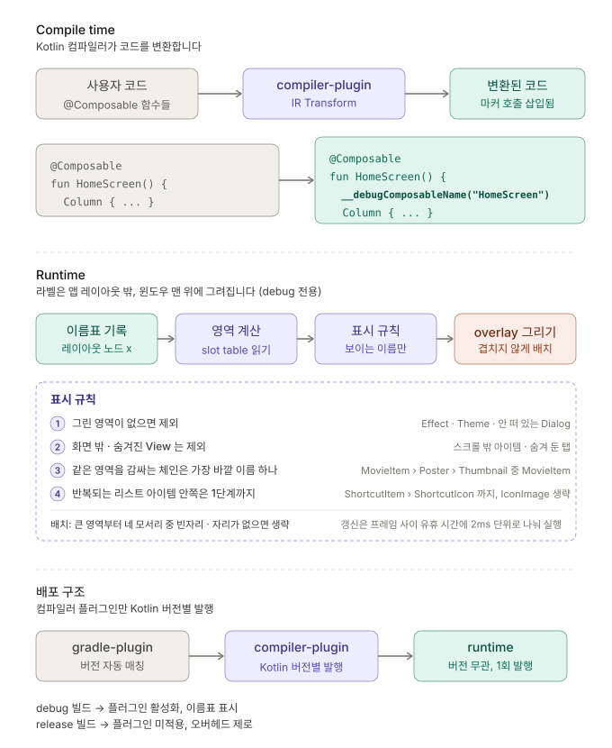

# Composable-Nametag

[](https://myhits.vercel.app)
[](https://developer.android.com)
[](https://developer.android.com)
[](https://central.sonatype.com/artifact/io.github.dongx0915.composable.nametag/composable-nametag-runtime)


**[English README](./README.md)**

## 개요


<br>
<br>

Compose 화면에 보이는 `@Composable` 함수의 이름을 라벨로 오버레이하는 디버그 도구입니다.

**기존 코드를 수정하지 않고**, Kotlin Compiler Plugin(KCP)이 컴파일 시점에 자동으로 주입합니다.  
각 Composable의 이름을 화면에서 직접 확인할 수 있어, 레이아웃 디버깅과 코드 리뷰가 빨라집니다.

<br>

## 스크린샷
<div align="center">
    
</div>

<br>

## 주요 기능

- **자동 주입** — 기존 코드를 건드리지 않아도 Compiler Plugin이 컴파일 시점에 라벨을 삽입합니다.
- **보이는 것만 표시** — 각 Composable이 실제로 그린 영역을 기준으로 라벨을 붙입니다. Effect·Theme처럼 화면에 그리는 것이 없는 Composable과, 화면 밖이거나 숨겨진 View는 제외합니다.
- **겹치지 않는 라벨** — 같은 영역을 감싸는 래퍼 체인은 가장 바깥 이름 하나만, 반복되는 리스트 아이템은 안쪽 1단계까지만 표시하고, 라벨끼리 겹치지 않게 배치합니다.
- **레이아웃 무간섭** — 라벨은 앱 레이아웃이 아니라 윈도우 overlay에 그려지므로 간격이나 배치를 바꾸지 않습니다.
- **Debug 전용** — 컴파일러 플러그인과 런타임은 `debug` 빌드에만 적용됩니다. Release 빌드에는 라이브러리 코드가 전혀 포함되지 않습니다.
- **제로 오버헤드** — 컴파일 시점에 IR 변환으로 동작합니다. Release 빌드에서는 코드 삽입도, 런타임 포함도 없습니다.
- **컴파일 시점 필터링** — PascalCase Composable만 라벨 대상으로 삼고, 람다·`remember`·프로퍼티 접근자 등은 무시합니다.
- **스킵 규칙 커스터마이즈** — 패키지 prefix, 이름 regex, 어노테이션으로 라벨 대상에서 추가 제외할 수 있습니다.
- **빌드 안전** — 지원하지 않는 Kotlin 버전에서는 플러그인만 비활성화되고, 빌드는 정상 동작합니다.

<br>
<br>

## 설치

### 저장소 설정

라이브러리가 호스팅된 위치에 따라 선택합니다.

#### Maven Central (기본)

`settings.gradle.kts`의 플러그인 저장소에 `mavenCentral()`을 추가합니다:

```kotlin
// settings.gradle.kts
pluginManagement {
    repositories {
        gradlePluginPortal()
        mavenCentral()  // ← 필요
        google()
    }
}
```

Convention Plugin을 사용하는 경우, `build-logic/settings.gradle.kts`의 `dependencyResolutionManagement.repositories`에도 추가합니다.

#### GitHub Packages

GitHub Packages를 통해서도 제공됩니다. `settings.gradle.kts`에 저장소를 추가합니다:

```kotlin
// settings.gradle.kts
pluginManagement {
    repositories {
        gradlePluginPortal()
        google()
        maven {
            url = uri("https://maven.pkg.github.com/{owner}/{repo}")
            credentials {
                username = providers.gradleProperty("gpr.user").orNull ?: System.getenv("GITHUB_ACTOR")
                password = providers.gradleProperty("gpr.token").orNull ?: System.getenv("GITHUB_TOKEN")
            }
        }
    }
}
```

Convention Plugin을 사용하는 경우, `build-logic/settings.gradle.kts`의 `dependencyResolutionManagement.repositories`에도 동일한 `maven { ... }` 블록을 추가합니다.

> `~/.gradle/gradle.properties`에 인증 정보를 설정합니다:
> ```properties
> gpr.user=your-github-username
> gpr.token=ghp_xxxxxxxxxxxxxxxxxxxx  # read:packages 권한 필요
> ```

<br>
<br>

### 방법 A. `plugins {}` 블록으로 직접 적용

**Compose를 사용하는 모듈**의 `build.gradle.kts`에 플러그인을 적용합니다.
반드시 **Compose 플러그인보다 먼저** 선언해야 합니다.

```kotlin
// feature/home/build.gradle.kts (Compose 모듈)
plugins {
    id("{group-id}") version "{library-version}" // Compose 플러그인보다 먼저
    id("org.jetbrains.kotlin.plugin.compose") version "2.1.21"
    // ...
}
```

> [!note]
> 별도의 `implementation` 의존성은 필요 없습니다 — 플러그인이 runtime 라이브러리를 자동으로 추가합니다.
>
> `{group-id}`는 배포 시 설정한 GROUP입니다 (예: Maven Central의 경우 `io.github.dongx0915.composable.nametag`).

<br>
<br>

### 방법 B. Convention Plugin을 통한 적용

build-logic 등 Convention Plugin 구조를 사용하는 프로젝트에서의 적용 방법입니다.

<br>

**Step 1.** `build-logic/convention/build.gradle.kts`에 플러그인 아티팩트를 추가합니다:

```kotlin
dependencies {
    implementation("{group-id}:composable-nametag-gradle:{library-version}")
}
```

<br>

**Step 2.** Compose Convention Plugin 내부에서 **Compose 플러그인보다 먼저** 적용합니다:

```kotlin
// 예: AndroidComposeConventionPlugin.kt
class AndroidComposeConventionPlugin : Plugin<Project> {
    override fun apply(target: Project) {
        with(target) {
            pluginManager.apply("{group-id}") // Compose 플러그인보다 먼저
            pluginManager.apply("org.jetbrains.kotlin.plugin.compose")
            // ...
        }
    }
}
```

<br>
<br>

### 요구사항

- Android API 24 (Android 7.0) 이상
- Kotlin **2.1.21 ~ 2.3.20** ([지원 버전 목록](#kotlin-버전-호환성) 참조)
- Jetpack Compose (BOM 2025.05.01 또는 호환 버전)
- JDK 17+

<br>
<br>

## 사용법

### 오버레이 활성화

```kotlin
// Application 또는 원하는 시점에서
ComposeDebugConfig.enabled = true
```

끝입니다. 화면에 보이는 `@Composable`에 이름 라벨이 표시됩니다.

<br>
<br>

## 동작 원리

<div align="center">
    
</div>

<br>

### 라벨 표시 방식

컴파일러가 삽입한 마커는 레이아웃 노드를 만들지 않고 slot table에 이름표만 남깁니다.
런타임은 Layout Inspector와 같은 방식으로 slot table을 읽어 각 Composable이 실제로 그린 영역을 계산하고, 아래 규칙으로 고른 라벨을 윈도우 맨 위(overlay)에 그립니다.

| 규칙 | 예 |
|------|----|
| 그린 영역이 없으면 제외 | Effect, Theme, 안 떠 있는 Dialog |
| 화면 밖이거나 숨겨진 View는 제외 | 스크롤로 밀려난 아이템, 숨겨 둔 탭 |
| 같은 영역을 감싸는 체인은 가장 바깥 이름 하나 | `MovieItem › Poster › Thumbnail` 중 `MovieItem` |
| 반복되는 리스트 아이템 안쪽은 1단계까지 | `ShortcutItem › ShortcutIcon`까지 표시, `IconImage`는 생략 |

- **배치** — 큰 영역부터 라벨을 놓고, 영역의 네 모서리 중 빈자리를 찾습니다. 자리가 없으면 그 라벨은 생략합니다.
- **성능** — 라벨 갱신은 프레임 사이의 유휴 시간에 약 2ms 단위로 나눠 실행되어, 스크롤 중 프레임을 지연시키지 않도록 동작합니다. 화면이 멈춰 있으면 갱신 간격이 최대 800ms까지 늘어납니다.

<br>
<br>

## 필터링 규칙 (컴파일 시점)

라벨 마커를 주입할 함수를 고르는 규칙입니다. 화면에 어떤 라벨을 보여줄지는 [라벨 표시 방식](#라벨-표시-방식)을 참고하세요.

| 조건 | 처리 |
|------|------|
| 대문자로 시작하는 @Composable | ✅ 라벨 표시 |
| 소문자로 시작 (remember, modifier 등) | ❌ 스킵 |
| 람다 / anonymous | ❌ 스킵 |
| Property accessor | ❌ 스킵 |
| `__` 접두사 | ❌ 스킵 |

<br>
<br>

## 사용자 정의 스킵 규칙

기본 필터에 더해, `composableNametag { }` DSL로 라벨 대상에서 추가 제외할 수 있습니다.

### 옵션

| 프로퍼티 | 타입 | 설명 |
|----------|------|------|
| `skipPackages` | `List<String>` | 패키지 FQN prefix. 파일 패키지가 일치하거나 하위 패키지인 함수를 스킵합니다. |
| `skipNamePatterns` | `List<String>` | Java regex 패턴. 함수 이름이 패턴에 **전체 일치**하면 스킵합니다. |
| `skipAnnotations` | `List<String>` | 어노테이션의 전체 FQN. 해당 어노테이션이 붙은 함수를 스킵합니다. |

모든 규칙은 기본 규칙과 **OR로 결합**됩니다 — 하나라도 매칭되면 라벨이 주입되지 않습니다.

### 모듈별 설정

```kotlin
// feature/home/build.gradle.kts
composableNametag {
    skipPackages.addAll(
        "com.myapp.internal",
        "com.myapp.designsystem.foundation",
    )
    skipNamePatterns.addAll(
        ".*Preview$",   // `XxxPreview` 스킵
        "^Themed.*",    // `ThemedXxx` 스킵
    )
}
```

`skipAnnotations`에는 프로젝트 내에서 정의한 어노테이션의 전체 FQN(예: `"com.myapp.debug.MyInternalMarker"`)을 등록하면, 해당 어노테이션이 붙은 composable이 스킵됩니다.

### 전역 적용 (Convention Plugin)

Convention Plugin에서 한 번만 설정해 모든 Compose 모듈에 공통 적용:

```kotlin
// AndroidComposeConventionPlugin.kt
import com.donglab.compose.debug.gradle.ComposableNametagExtension

pluginManager.apply("{group-id}")
pluginManager.apply("org.jetbrains.kotlin.plugin.compose")

extensions.configure<ComposableNametagExtension> {
    skipNamePatterns.add(".*Preview$")
}
```

개별 모듈의 `build.gradle.kts`에서 추가 규칙을 얹을 수도 있습니다 — `ListProperty.add/addAll`은 누적됩니다.

> [!note]
> 모든 필터링은 컴파일 타임에 수행되므로 규칙을 아무리 많이 추가해도 런타임 비용은 0입니다.

<br>
<br>

## Kotlin 버전 호환성

컴파일러 플러그인은 Kotlin IR 내부 API를 사용하므로 **Kotlin 버전별로 발행**됩니다.
Gradle 플러그인이 프로젝트의 Kotlin 버전을 자동 감지하여 맞는 컴파일러 아티팩트를 선택합니다.

| Kotlin 버전 | 지원 여부 |
|------------|----------|
| 2.1.21 | ✅ |
| 2.2.0 | ✅ |
| 2.2.10 | ✅ |
| 2.2.20 | ✅ |
| 2.2.21 | ✅ |
| 2.3.0 | ✅ |
| 2.3.10 | ✅ |
| 2.3.20 | ✅ |

- **미지원 버전**: 경고 1회 출력 후 컴파일러 플러그인만 비활성화. 빌드는 정상 진행.

```
⚠️  compose-debug-overlay: Kotlin X.Y.Z is not supported.
    → Your build and app are NOT affected.
```

<br>
<br>

## Release 안전성

Composable-Nametag은 **release 빌드에서 완전히 제외**됩니다:

| | Debug 빌드 | Release 빌드 |
|---|---|---|
| 컴파일러 플러그인 (IR 코드 삽입) | 동작 | 미적용 |
| Runtime 라이브러리 (APK 포함) | 포함 | 미포함 |

- Gradle 플러그인이 `debugImplementation`으로 런타임을 추가하므로, release APK에는 포함되지 않습니다.
- 컴파일러 플러그인의 `isApplicable`이 debug가 아닌 compilation에서 `false`를 반환하므로, release 빌드에는 코드가 삽입되지 않습니다.
- **결과**: Release APK에 이 라이브러리의 흔적이 전혀 남지 않습니다. 성능 영향 없음, 바이너리 크기 증가 없음.

<br>
<br>

## 기술 스택

- Kotlin 2.1.21 ~ 2.3.20
- AGP 8.6.1
- Compose BOM 2025.05.01
- Gradle 8.7

<br>
<br>

## 라이선스

Apache License 2.0
